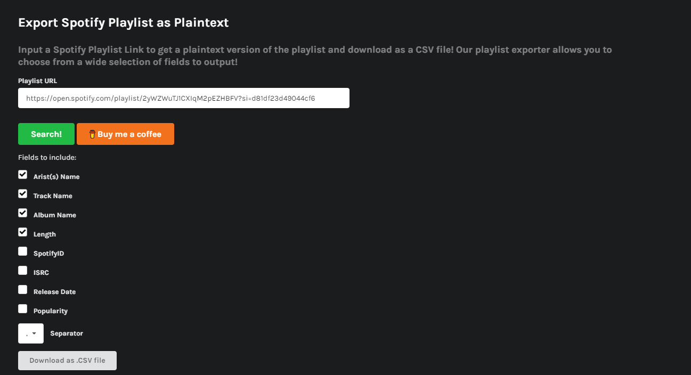

# Spotify DL (could be applied to any other platform)

This program allows to download through song names the song listed in a file like so:
```
Artist(s) Name, Track Name, Album Name, Length
```
If the format don't match this, the row analyzed by the program will skip it.

Link To obtain this kind of file: https://www.spotlistr.com/export/spotify-playlist!
You can search through every spotify playlist and just copy/paste the link on this website.
Do like the following:


# BUILD & EXEC
```
$> python3 -m venv env
$> .\env\bin\activate
$> pip install -r requirements.txt
$> python3 ./YTDownloaderMP3.py <csv_file> <dl_folder_name_to_create>
```
